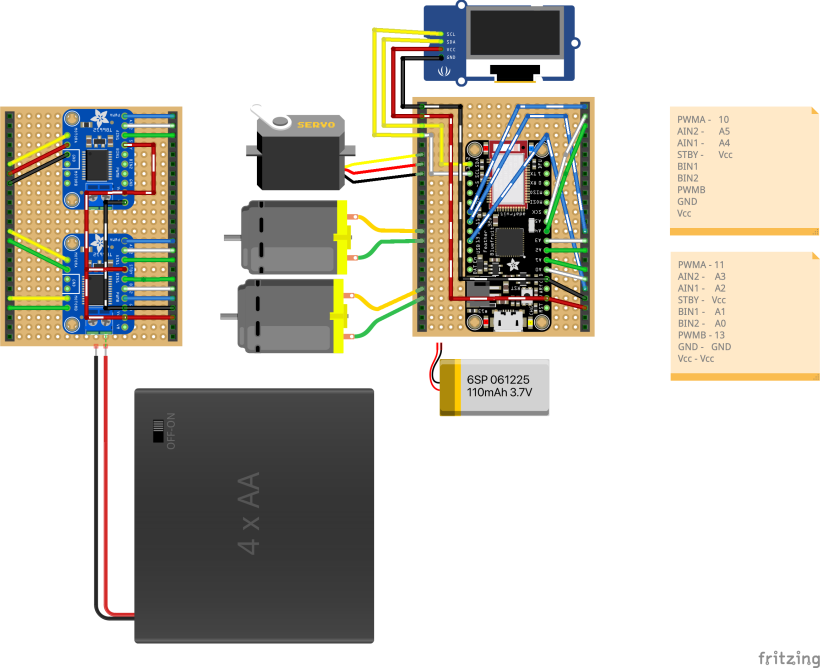

# strawberry-robot
Code for a small two-wheeled robot

Microcontroller: Bluefruit Feather 32u4
* 2 motors - TT 5V
* 1 castor wheel
* 1 servo - to move "head"
* 1 OLED screen - to display "Face"

Feather Inputs (via BlueFruit Connect App -> Controller -> Control Pad)
* Drive inputs - buttons 5-8

Board layout:

